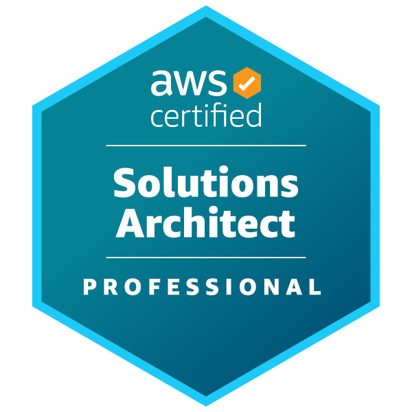
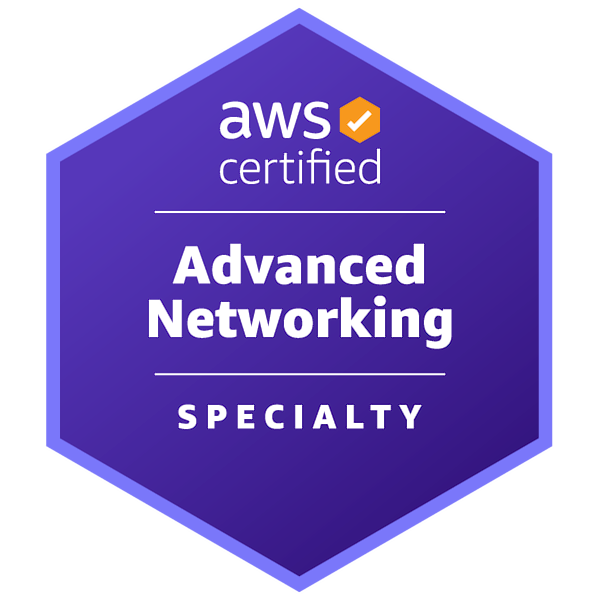
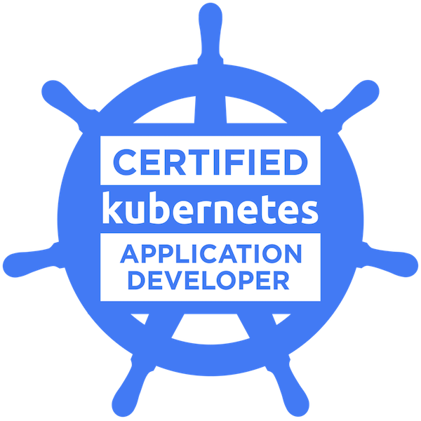
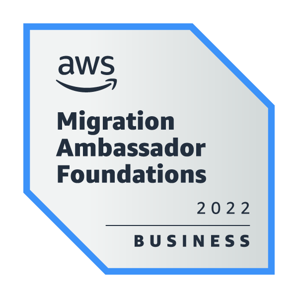

# Hello All! 

👋👋👋 Hello All 👋👋👋

<table>
    <tr>
        <td></td>
        <td></td>
        <td></td>
        <td></td>
    </tr>
    <tr>
        <td></td>
        <td></td>
        <td></td>
        <td></td>
    </tr>
</table>

## 😄 About

With 10+ years of professional experience working in international companies, specialized in DevOps, I have deep knowledge and hands-on experience in Python, Docker, Kubernetes, AWS, DevOps. I am familiar with Agile development methodology. Also, I have experience from designing scalable and highly availability system, disaster recovering plan, tuning and hardening monitoring system, supporting end-user requests, investigating and troubleshooting issues, and responding to incidents. My interests are big data, data analytics, distributed computing, cloud security and GoLang. I am maintaining my homelab environment to actively explore and experiment with various technologies, continuously enhancing my expertise beyond work-related domains.

I am certified in \textbf{Kubernetes} with CKA, CKAD and AWS with AWS-SAA, AWS-DVA, AWS-SAP, AWS-ANS. I am expertise in Python but not limit myself to learn more about GoLang. Currently, I am working as a Application Architect Project Lead in Solution Center of Excellent team at LG CNS (Hanoi, Vietnam).

Visit [my credly profile](https://www.credly.com/users/duy-chu/badges) to know more.

## 🙏 Open Source

Most of the time I spend will be reading about Python and new technology around it,

## 💻 Study and Work

I love to explore new technologies. I usually O'Reilly live events and published books to study
Some badges I'd like to share, it is not my stong point, but it is what I have learned and achieved

I have my own homelab which I am actively testing and optimizing it with new technologies, tools, frameworks

<table>
    <tr>
        <td></td>
        <td></td>
        <td></td>
        <td></td>
        <td></td>
        <td></td>
    </tr>

</table>

- **Python** - Almost Everywhere

## 🖊️ Writing

Last updated by Github Actions on 05 Feb, 2025.