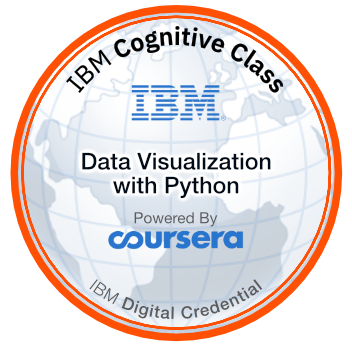

On this planet for **11200 days**.

# Hello All! 

👋👋👋 Hello All 👋👋👋

<table>
    <tr>
        <td></td>
        <td></td>
        <td></td>
        <td></td>
    </tr>

</table>

## 😄 About

With more than 8 years of experience spreading from System to Automation engineer and DevOps engineer, I am good at automa-
tion skills, experienced in automation of test-cases using Python language, strong understanding networking concepts (TCP/IP,
L2, L3, HTTP, DNS, etc.) as well as CI/CD and DevOps mindsets. 

I am familiar with Agile development style/methodology and its
related tools. I have been spending a lot of time to learn and discover about Python, Docker, Kubernetes, AWS, DevOps best prac-
tices and open-sourced projects and apply it into work organization. My other interests are big data, data analytics, distributed-
computing and MLOps.

I am Certified Kubernetes Administrator (CKA) and having 2x AWS Certified now. I am expertise in Python. Currently, I am working
as a Technical Lead at HCL Technologies (Vietnam Office branch, Hanoi ODC).

Visit [my credly profile](https://www.credly.com/users/duy-chu/badges) to know more.

## 🙏 Open Source

Most of the time I spend will be reading about Python and new technology around it,

## 💻 Study and Work

I love to explore new technologies. I usually O'Reilly live events and published books to study
Some badges I'd like to share, it is not my stong point, but it is what I have learned and achieved

<table>
    <tr>
        <td></td>
        <td></td>
        <td></td>
    </tr>
    <tr>
        <td></td>
        <td></td>
        <td></td>
    </tr>

</table>

- **Python** - Almost Everywhere

## 🖊️ Writing

Last updated by Github Actions on 20 May, 2023.